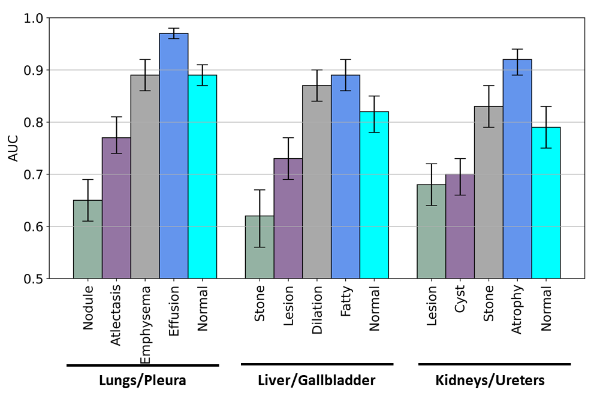
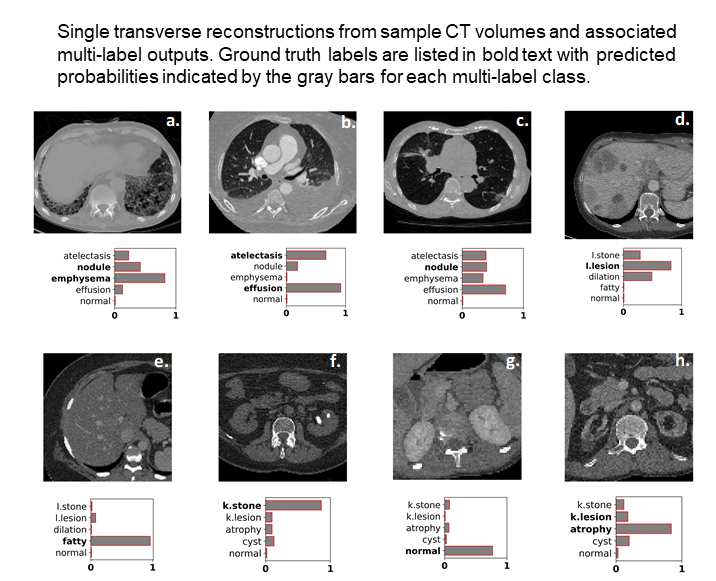
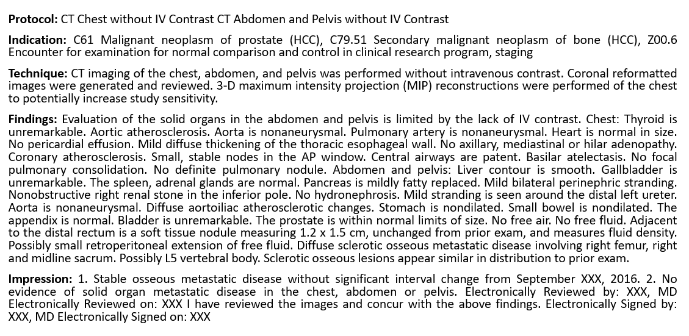
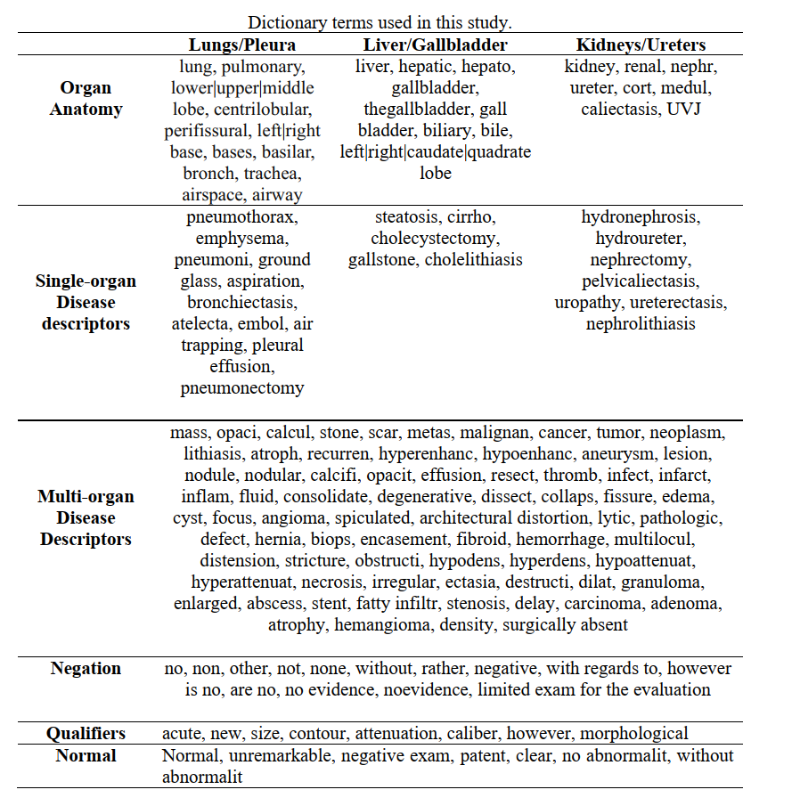
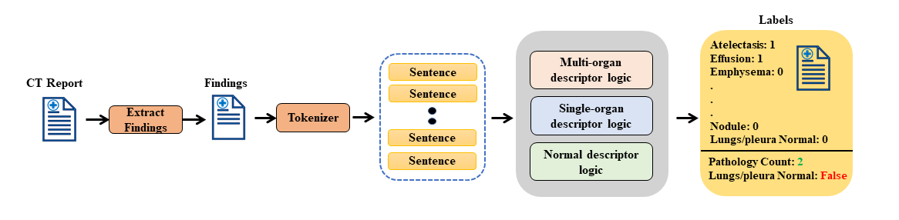
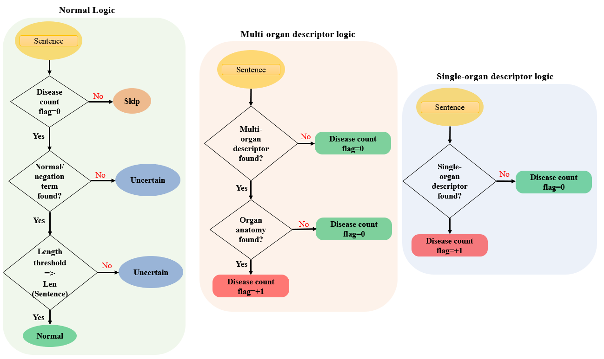
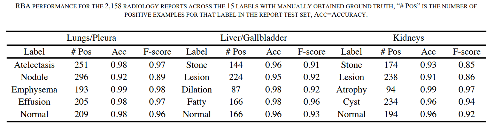
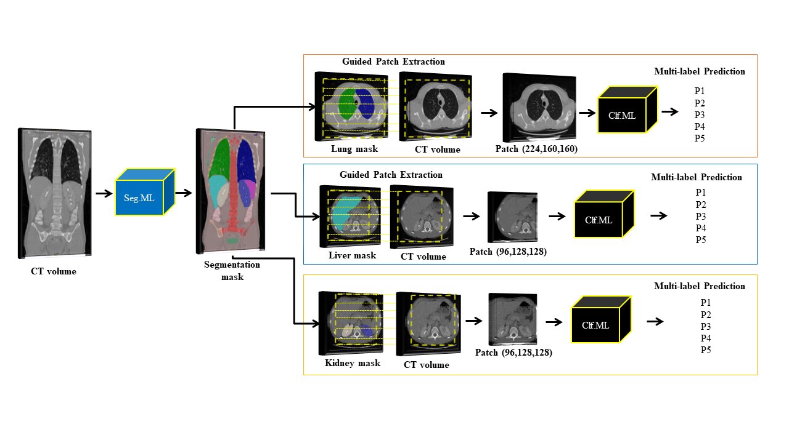

# Multi-Disease Classification of 13,667 Body CT Scans Using Weakly Supervised Deep Learning

A rule-based algorithm enabled automatic extraction of disease labels from tens of thousands of radiology reports. These weak labels were used to create deep learning models to classify multiple diseases for three different organ systems in body CT. This Repo contains the updated implementation of our paper **"Multi-Disease Classification of 13,667 Body CT ScansUsing Weakly-Supervised Deep Learning"** (Under-review). A pre-print is available: **"Weakly Supervised Multi-Organ Multi-Disease Classification of Body CT Scans"**:https://arxiv.org/abs/2008.01158.

### Citation
```ruby
F. I. Tushar et al., "Classification of Multiple Diseases on Body CT Scans Using Weakly Supervised Deep Learning,"
Radiology: Artificial Intelligence, vol. 4, no. 1, p. e210026, 2022.
```


### Abstract

**Background:** Training deep learning classifiers typically requires massive amounts of manual annotation. Weak supervision may
leverage existing medical data to classify multiple organ systems and diseases.

**Purpose:** To design multi-disease classifiers for body computed tomography (CT) scans using automatically extracted labels
from radiology text reports.


**Materials & Methods:** This retrospective study deployed rule-based algorithms to extract 19,255 disease labels from reports of 13,667
body CT scans of 12,092 subjects for training. Using a 3D DenseVNet, three organ systems were segmented:
lungs/pleura, liver/gallbladder, and kidneys/ureters. For each organ, a 3D convolutional neural network classified
normality versus four common diseases. Testing was performed on an additional 2,158 CT volumes relative to 2,875
manually derived reference labels.

**Results:** Manual validation of the extracted labels confirmed 91 to 99% accuracy. Performance using the receiver
operating characteristic area under the curve (AUC) for lungs/pleura labels were as follows: atelectasis 0.77 (95%
CI: 0.74 to 0.81), nodule 0.65 (0.61 to 0.69), emphysema 0.89 (0.86 to 0.92), effusion 0.97 (0.96 to 0.98), and
normal 0.89 (0.87 to 0.91). For liver/gallbladder: stone 0.62 (0.56 to 0.67), lesion 0.73 (0.69 to 0.77), dilation 0.87
(0.84 to 0.90), fatty 0.89 (0.86 to 0.92), and normal 0.82 (0.78 to 0.85). For kidneys/ureters: stone 0.83 (0.79 to
0.87), atrophy 0.92 (0.89 to 0.94), lesion 0.68 (0.64 to 0.72), cyst 0.70 (0.66 to 0.73), and normal 0.79 (0.75 to 0.83).

**Conclusion:** Weakly supervised deep learning classifiers leveraged massive amounts of unannotated body CT data to classify
multiple organ systems and diseases.

### Results



# Study Overview:
This Study contains three main modules:

* **1.**  Developed and Used RBA to generate labels from radiology reports.
* **2.** Segmentation Module to extracted segmentation mask from the CT volume and
* **3.** Classification Module With three independent classifiers to classify disease in lungs/pleura, liver/gallbladder, and kidneys/ureters.


# Rule-Based Algorithm (RBA):
In this section, we describe and outline the development processes of our RBA.

A radiology CT report contains a protocol, indication, technique, findings, and impression sections. RBA was limited to the findings section of the CT reports minimizing the influence of biasing information referenced in other sections and ensuring that the automated annotation reflected image information in the current exam (e.g., indication for the exam, patient history, technique factors, and comparison with priors). For example, the impression section could describe a diagnosis based on patient history that could not be made using solely image-based information.

|  | 
|:--:| 
| *Representative example of a body CT radiology report within our dataset.* |


We used a dictionary approach to develop RBAs to extract disease labels from radiology text reports. To select target disease and organ keywords for the RBA dictionary, we computed term frequency-inverse document frequency (TF-IDF) on the findings sections of a random batch of 3,500 radiology reports. A board-certified radiologist guided to define the TF-IDF terms into several categories, specifically: 
* a) single-organ descriptors specific to each organ, e.g., pleural effusion or steatosis, 
* b) multi-organ descriptors applicable to numerous organs, e.g., nodule or stone, 
* c) negation terms indicating the absence of disease, e.g., no or without, 
* d) qualifier terms describing confounding conditions, e.g., however, OR 
* e) normal terms suggesting normal anatomy in the absence of other diseases and abnormalities, e.g., unremarkable.



|:--:|    
| **Dictionary terms used in this study.** |

The figure above displays the dictionary terms and their descriptor type for each organ system.

 



Above figure displays an overview of the RBA’s flowchart and logic. Although a separate RBA was created for each organ system, the workflow was the same. After the dictionary was refined, report text was converted to lowercase, and each sentence was tokenized. In summary, the RBA was deployed on each sentence, and the number of potential diseases was counted first using the logic for the multi-organ descriptor and then the single-organ descriptor. If no potential disease labels were detected, then the normal descriptor logic was finally applied to verify normality. This process was repeated for each disease outcome allowing a report to be positive for one or more diseases or normal. Note that in this study an organ system was defined as normal not only by excluding the four diseases studied but also in the absence of dozens of abnormalities and diseases states that were not otherwise analyzed, as shown in Appendix 1. If the RBA failed to categorize the report definitively as positive for disease or normal (e.g., there was no mention of the organ system), then the report was labeled as uncertain and was not included in this study.

We observed that many reports were incorrectly labeled normal due to excessively long, complex sentences with multiple clauses or fused together due to grammatical errors (e.g., missing periods). Such sentences were impractical to analyze with simple logic, so each report sentence was subject to a length criterion threshold for the normal outcome.


|:--:|    
| **RBA performance for 2,158 radiology reports across 15 labels using manually obtained ground truth.** |


## How to Run RBAs

- 1. **Use this docker container to run the RBA codes `docker pull ft42/ct_predict_ft42:rba_tf2_gpu_py3`**
- 2. RBA codes are given in Directory `RBA `
      * i) **Lungs_RBA**-|->Lungs RBA codes
      ```ruby
            a) RBA_Lung_Config.py  |-- Configuration file of RBA to input data, dictonary and path to save created dictonary.
            b) RBA_Lungs.py        |-- RBA Main.py.
            
      ```
      * ii) **Liver_RBA**-|->Liver RBA codes
      ```ruby
            a) RBA_Liver_Config.py           |-- Configuration file of RBA to input data, dictonary and path to save created dictonary.
            b) RBA_Liver.py                  |-- RBA Main.py.
            c) RBA_Liver_Statistics.py       |-- generate Satatistics
            
      ```
       * iii) **Kidneys_RBA**-|->Kidneys RBA codes
      ```ruby
            a) RBA_Kidneys_Config.py         |-- Configuration and RBA are inside the code this is main RBA py for kedney.
            b) RBA_Kidneys.py                  |-- RBA Main.py.
            c) RBA_Kidneys_Statistics.py       |-- generate Satatistics
      ```


* `RBA_Lung_Config.py.py`
```ruby
####0000000000000-----INPUTS----------0000
REPORT_CSV="/path/to/report/csv/report.csv"


LUNG_ORGAN_LIST = ['lung',
                  ['lung','pulmonary'],
                  ['lung', 'pulmonary', '(lower|upper|middle)\s+lobe', 'centrilobular', 'perifissural','(left|right)\s+base\s', 'bases', 'basilar', 'bronch', 'trachea', 'airspace', 'airway']]


COMMON_DIS_LIST = ['mass','opaci', 'calcul', 'stone', 'scar', 'metas', 'malignan', 'cancer', 'tumor', 'neoplasm', 'lithiasis', 'atroph', 'recurren',
                  'hyperenhanc' , 'hypoenhanc', 'aneurysm', 'lesion', 'nodule', 'nodular', 'calcifi', 'opacit', 'effusion', 'resect', 'thromb', 'infect', 'infarct',
                  'inflam', 'fluid', 'consolidat', 'degenerative', 'dissect', 'collaps', 'fissure', 'edema', 'cyst', 'focus', 'angioma', 'spiculated', 'architectural\s+distortion',
                  'lytic', 'pathologic', 'defect', 'hernia', 'biops', 'encasement', 'fibroid', 'hemorrhage', 'multilocul', 'distension','distention', 'stricture', 'obstructi',
                  'hypodens', 'hyperdens', 'hypoattenuat', 'hyperattenuat', 'necrosis', 'irregular', 'ectasia', 'destructi', 'dilat', 'granuloma', 'enlarged', 'abscess', 'stent',
                   'fatty\s+infiltr', 'stenosis', 'delay', 'carcinoma', 'adenoma', 'atrophy', 'hemangioma', 'density', 'surgically\s+absent']

LUNG_DIS_LIST=['pneumothorax', 'emphysema', 'pneumoni', 'ground\s+glass', 'aspiration', 'bronchiectasis', 'atelecta', 'embol', 'fibrosis','air\s+trapping','pleural\s+effusion','pneumonectomy']
ABANDON_LIST = ['postsurgical', 'posttreatment', 'postradiation', 'postoperative', 'cholecystectomy', 'resection', 'cholelithiasis','cystectomy']


PATH_TO_SAVE_CSV="/path/to/save/dictonary/and/data/satatistics/Save_Satatistics/"

####-------|Statistics-----inputs-----------------|----###
LIST_FOR_OVERLAP_STATISTICS=['normal','mass','opaci', 'calcul', 'stone', 'scar', 'metas', 'malignan', 'cancer', 'tumor', 'neoplasm', 'lithiasis', 'atroph', 'recurren','pleural\s+effusion',
                  'hyperenhanc' , 'hypoenhanc', 'aneurysm', 'lesion', 'nodule', 'nodular', 'calcifi', 'opacit', 'effusion', 'resect', 'thromb', 'infect', 'infarct',
                  'inflam', 'fluid', 'consolidat', 'degenerative', 'dissect', 'collaps', 'fissure', 'edema', 'cyst', 'focus', 'angioma', 'spiculated', 'architectural\s+distortion',
                  'lytic', 'pathologic', 'defect', 'hernia', 'biops', 'encasement', 'fibroid', 'hemorrhage', 'multilocul', 'distension','distention', 'stricture', 'obstructi',
                  'hypodens', 'hyperdens', 'hypoattenuat', 'hyperattenuat', 'necrosis', 'irregular', 'ectasia', 'destructi', 'dilat', 'granuloma', 'enlarged', 'abscess', 'stent',
                   'fatty\s+infiltr', 'stenosis', 'delay', 'carcinoma', 'adenoma', 'atrophy', 'hemangioma', 'density', 'surgically\s+absent','pneumothorax', 'emphysema', 'pneumoni', 'ground\s+glass',
                   'aspiration', 'bronchiectasis', 'atelecta', 'embol', 'fibrosis','air\s+trapping']

DISEASE_NAME_AND_NUMBERS=PATH_TO_SAVE_CSV+"LungDisease_NameAndNumberDecending.csv"
DISEASE_COUNT_THRESHOLD= 1

```

# Image Segmentation

Segmentation model was used to guide extraction of organ-specific patches from CT volumes for subsequent classification. Figure below shown the overall classification pipeline used in this study.


|:--:|    
| **Overall classification framework.** |

The segmentation model was trained with CT volumes with organ margins labeled on each transverse section originally developed for the 4D extended cardiac-torso (XCAT) phantom. Fifty labeled CT volumes were randomly assigned into 44 training and 6 validation sets.Unlikely the liver/gallbladder and Kidneys/Uretters diseases we are working with the Lungs/pleura diseases/abnormalities we are working with could change the typical appearance of the lungs entirely like effusion, emphysema, pneumonia, nodule. Because the XCAT training set contains normal anatomy only, segmentation errors were observed when the normally aerated lungs were replaced by disease. 

The segmentation model was fine-tuned only for lungs to address these lung segmentation errors. The base segmentation model was used to generate a preliminary mask for 30 additional, randomly selected, diseased lung cases (ten edema, ten atelectasis, seven pneumonia, and three nodules). The resulting segmentation mask was then manually corrected to the lung margins. These 30 diseased cases with fixed segmentation were combined with ten normal XCAT training cases and fine-tuned and produced the final segmentation model.

* Segmentaion module was developed using niftynet() in tensorflow 1.xx platform
Pull and use this docker container to run the segmenation module: 
`docker pull ft42/ct_predict_ft42:data_deid_filtering_seg_tf1_py3`

```ruby
########################### DenseVnet ############################
This model is Trained by Tushar under the CT-Predict Project.
Model is been trained on 44 X-CAT CT volumes and fine-tuned with 30 Disease Cases.

This model is adopted from NiftyNet Implementation.
For more details: https://github.com/NifTK/NiftyNetModelZoo/blob/master/dense_vnet_abdominal_ct_model_zoo.md


Description:
a) "model_weights" folder contains the model weights.
b) "dice_hinge" loss function used.
c) "config" This file contains the hyper-parameter.

Instruction:

#How to run.

a)First install this libraries Installations
1#Install Tensorflow
2#install simpleitk
3#Install Niftynet: pip install niftynet
4#Download DenseVnet from niftynet: net_download dense_vnet_abdominal_ct_model_zoo

b) Provide the hyperparameter in "config"

1# "path_to_search"= Provide the path of your data.
    filename_contains= the common name part of ypur data suppose CT_XXXX
    thn put 'filename_contains=CT_'

2#  system configuration sections
    "model_dir" =  yourpath/model_weights.

3#  save_seg_dir = path_to_save_segmented_mask

c) Now use this command to run the model
   Test: "net_segment inference -c path_of_this_config_file/config.ini"


```

# Classification Module :

Prior to classification, all CT volumes were resampled to voxels of size 2 mm x 2 mm x 2 mm via B-spline interpolations, clipped to intensity range (-1000, 800) HU for lungs/pleura, (-200, 500) HU for liver/gallbladder and kidneys/ureters, and normalized to 0 mean and 1 standard-deviation. For each organ, the CT volumes were randomly divided into subsets to train (70%), validate (15%), and test (15%) the model. Splitting was performed by subject and separately for normal vs. diseased classes per organ to preserve disease prevalence across each subset.

Resnet inspired the 3D CNN used in this study. One initial convolution was performed on input volumes, and then features were learned in three resolution scales using three R-blocks in each resolution. An R-block consists of batch-normalization, rectified linear unit (ReLu) activation, and 3D convolution. A deeper network has greater discriminative power due to the additional non-linearities and better quality of local optima. However, convolutions with 3D kernels are computationally expensive, and 3D architectures have a more significant number of trainable parameters; thus, 3x3x3 kernels were used to reduce computational cost and model complexity. Batch normalization allowed for standardization of the feature map activation at every optimization step. After each resolution, the features were halved by max-pooling, and the number of filters was doubled. After the 3rd resolution, the last R-block features were passed through batch-normalization, ReLu, followed by a global max-pooling, dropout, and finally sigmoid classification layer for the final, multi-label predictions. Due to the computational expense it was not practical to feed the whole CT volume into 3D CNN. The final segmentation module was used to guide the extraction of sub-volume patches for each target organ. We extracted a single patch of size 224x160x160 (ZxWxH) for lungs/pleura and 96×128×128 (ZxWxH) for both liver/gallbladder and kidneys from each volume using the segmented mask. Adam was used to optimizing the weights, and weighted cross-entropy was used as the loss function. The uniform distribution did initialization of the weights.

## How to run classification:

Here we will go through step by step process how to get the results showed in Paper. To trained the classifier please use this docker container:
```ruby  
docker pull ft42/ct_predict_ft42:ct_clf_tf2_gpu_py3
``` 
## Directories and Files:
*  i) **Lungs_classification -|--> Lungs Classification module to generate tfrecords, train and test classifier**
    
      * (1) Generate_tfrecords-|-> Generate tfrecords for training, testing and validation
      ```ruby   
            a) config.py                 |-- Configuration tfrecords generation hyperparameter.
            b) Preprocessing_utlities.py |-- Preprocessing function such as Resampling,Hu cliping, and patch extraction function.
                                          ** For Lungs Tfrecords data is been pre-procces earlier-path of preprocessed data given in csv**
            c) tfrecords_utilities.py    |-- Tfrecords utilities for generating tfrecords
            d) generate_tf_records.py    |-- Generate tfrecords, Main File        
    ```

      * (2) Train_Classifier:
      ```ruby   
            a) config.py     |-- Configuration file to train the Classifier.
            b) Resnet_3D.py  |-- Classification Module
            c) loss_funnction_And_matrics |-- Loss Function.
            d) resume_training_using_check_point |-- Training-Mainb Script
            e) tfrecords_utilities |-- Tfrecords decoding function
            f) Preprocessing_utlities |-- Preprocessing function such as Resampling,Hu cliping, and patch extraction function.
            g) LungML_3.90_31.h5      |-- Trained Model Weight
      ```
*  ii) **Liver_classification -|--> Liver Classification module to generate tfrecords, train and test classifier**
```ruby
   Similar folder structutes and files as shown above for Lungs in (i)         
```

*  iii) **Kidneys_classification -|--> Kidneys Classification module to generate tfrecords, train and test classifier**
```ruby
   Similar folder structutes and files as shown above for Lungs in (i)         
```


# Creast tfrecords for training, validation and testing:

To generate the tfrecords for training , validation and testing, need to do is to use the codes in folder `Lungs_classification/Generate_tfrecords`.
To run the tfrecord geneator all is needed is to configure the `config.py` based on your requiremnet. and use the command 

* `python generate_tf_records.py.py`

* `config.py` for liver and kidneys are also similar **the only the difference is that, 
while gnerating the tfrecords for Lungs and Liver we had pre-procced the data offline so tfrecord generator doesn't perform any Preprocessing,
but for kidneys preproceesing where performed onfly while generating the tfrecords.** to understand more check `tfrecords_utilities.py-> function creat_tfrecord()`

* Lungs Tfrecords patch size=[224,160,160]
* Liver Tfrecords patch size=[96,128,128]
* kidneys Tfrecords patch size=[96,128,128]

* `config.py`
```ruby
import tensorflow as tf #import tensotflow
###---Number-of-GPU
DATA_CSV='/Local/nobackup/Lung_CenterPatch_2mm_April20_P224/Lung_Train_March27_2020_UPDTRBM.csv' # .csv having path of data
PATH_TO_SAVE_TFRECORDS='/Local/nobackup/Lung_CenterPatch_2mm_April20_P224/Lung_tfrecords/Train_tfrecords/' #--tfrecord seving path
NAME_OF_PATH_CSV='Lung_Train_224_160x160_patches' #---Save a csv with the generated tfrecords name
PATH_TO_SAVE_MIDDLE_SLICE_PNG='/Local/nobackup/Lung_CenterPatch_2mm_April20_P224/Lung_tfrecords/Train_tfrecords_mask/' #--Save a png image of tfrecords
SAVING_PNG_OF_THE_PATCH='/Local/nobackup/Lung_CenterPatch_2mm_April20_P224/Lung_tfrecords/Train_tfrecords_png/' #--png saved path
COLORMAP='gist_stern' #overlapping color for png
ALPHA_VALUES_CT=1     
ALPHA_VALUES_MASK=0.5

###--------------------tfrecords Generator Parameters
PATCH_PARAMS = {'n_examples': 1,   # how many patches to extract from a CT
                 'example_size': [224, 160, 160], 
                 'extract_examples': True}
NUM_OF_CTS_IN_SINGLE_TFRECORDS=1   # HOW MANY patches to save in a single tfrecords
```

# Training Classifier

To train the classifier all you need is to use the config file and modities it based on your use (such as Batch size, # of gpu, loss functions,parsing,perrale calling model resolution, learning rate.)

`python resume_training_using_check_point.py`

* `config.py`
```ruby
import tensorflow as tf
from loss_funnction_And_matrics import* # import loss function 
import math 
###---Number-of-GPU
NUM_OF_GPU=2
DISTRIIBUTED_STRATEGY_GPUS=["gpu:0","gpu:1"] # gpus to use
###----Resume-Training
RESUME_TRAINING=0      #if resuming the training then 1 otherwise 0
RESUME_TRAIING_MODEL='/image_data/Scripts/April_Model/Lung_Clf_April22_2020/Lung_Model_April22_2020/' #weight path if resuming training
TRAINING_INITIAL_EPOCH=0 #number of epoch from where resuming the training

##Network Configuration
NUMBER_OF_CLASSES=5  
INPUT_PATCH_SIZE=(224,160,160, 1)
TRAIN_NUM_RES_UNIT=3 # number of R-blocks each resolution
TRAIN_NUM_FILTERS=(16, 32, 64, 128) # how many resolution to contract the CNN
TRAIN_STRIDES=((1, 1, 1), (2, 2, 2), (2, 2, 2), (2, 2, 2)) # Strides to use in each resolutions
TRAIN_CLASSIFY_ACTICATION=tf.nn.relu6  #define activation
TRAIN_KERNAL_INITIALIZER=tf.keras.initializers.VarianceScaling(distribution='uniform') #kernal initializer
##Training Hyper-Parameter
##Training Hyper-Parameter
TRAIN_CLASSIFY_LEARNING_RATE =1e-4
TRAIN_CLASSIFY_LOSS=Weighted_BCTL
OPTIMIZER=tf.keras.optimizers.Adam(lr=TRAIN_CLASSIFY_LEARNING_RATE,epsilon=1e-5)
TRAIN_CLASSIFY_METRICS=tf.keras.metrics.AUC()
BATCH_SIZE=6
TRAINING_STEP_PER_EPOCH=math.ceil((3514)/BATCH_SIZE)
VALIDATION_STEP=math.ceil((759)/BATCH_SIZE)
TRAING_EPOCH=300
NUMBER_OF_PARALLEL_CALL=6
PARSHING=4*BATCH_SIZE
#--Callbacks-----
ModelCheckpoint_MOTITOR='val_loss' 
TRAINING_SAVE_MODEL_PATH='/image_data/Scripts/April_Model/Lung_Clf_April22_2020/Lung_Model_April22_2020/' #path to save model weight
TRAINING_CSV='Lung_Model_April22_2020.csv'
LOG_NAME="Lung_Log_April22_2020" #log folder
MODEL_SAVING_NAME="LungML_{val_loss:.2f}_{epoch}.h5" #model weight name


####
TRAINING_TF_RECORDS='/image_data/nobackup/Lung_CenterPatch_2mm_April20_P224/all_tf/Train_tfrecords/' #training tfrecords path
VALIDATION_TF_RECORDS='/image_data/nobackup/Lung_CenterPatch_2mm_April20_P224/all_tf/Val_tfrecords/' #validation tfrecords path.


```


